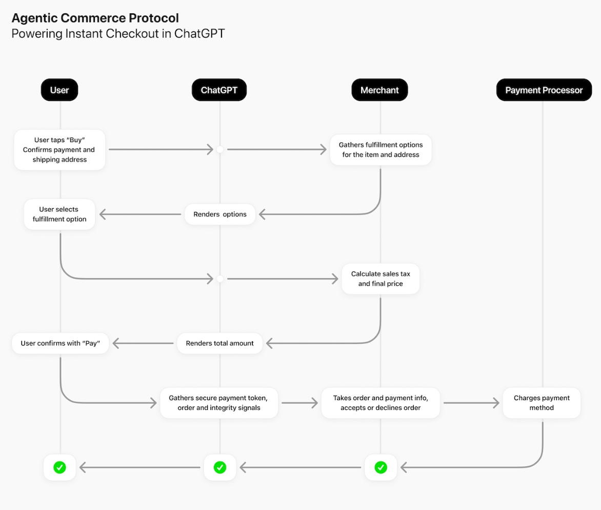

# ACP Checkout: Agentic Commerce Protocol Demo (FastAPI + Mock Payments)

## Table of Contents
1. [Purpose](#1-purpose)
2. [High-Level Architecture](#2-high-level-architecture)
3. [System Interaction Flow](#3-system-interaction-flow)
4. [Why the Agentic Commerce Protocol Matters](#4-why-the-agentic-commerce-protocol-matters)
5. [Challenges and Open Questions](#5-challenges-and-open-questions)
6. [Early Adopters](#6-early-adopters)
7. [Competing Protocol-AP2](#7-competing-protocol-ap2)
8. [Run Demo](#8-run-demo)
9. [Test the API with Postman](#9-test-the-api-with-postman)

---

## 1. Purpose

ACP Checkout (FastAPI) is a lightweight educational prototype that demonstrates how merchant applications and chat-based AI agents can simulate commerce workflows using the emerging Agentic Commerce Protocol (ACP) — allowing users to buy things securely within a conversation rather than being redirected to an external website.

This project illustrates how chat-based AI agents can:
- Create, update, complete, and cancel checkout sessions through **mock ACP-standard endpoints**.
- Simulate payment authorization and fulfillment in a **sandbox (mock) environment** for local testing.

The goal is to illustrate how ACP simplifies the in-chat buying experience, allowing users to complete **mock purchases** safely and instantly without leaving the conversation.

This demo is built using **[FastAPI](https://fastapi.tiangolo.com/)** — a modern, high-performance Python web framework ideal for rapid API prototyping and data validation.

## 2. High-Level Architecture

The diagram below illustrates how the main components of the ACP Checkout system interact:


*Image source: Adapted from [OpenAI Agentic Commerce Protocol](https://developers.openai.com/commerce/guides/key-concepts)*

## 3. System Interaction Flow
Here’s how the key components interact within the overall system:

- __Front end (User + AI Agent Platform)__
    * The user interacts with an AI interface (chat, voice)
    * The AI agent knows how to trigger commerce flows (via ACP)

- __Agent ↔ Merchant interface (ACP endpoints)__
    * The merchant runs a service exposing endpoints like /checkout_sessions (create/update), /complete, etc.
    * The agent makes REST API calls to these endpoints, passing structured data (items, address, payment token, etc)

- __Payment Service Provider (PSP) + Delegated Payment__
    * The merchant uses its existing PSP (Stripe etc) for actual charges
    * In the ACP flow, a payment token or delegated payment credential is passed so sensitive payment info is handled securely

- __Merchant Back-end / Fulfillment__
    * The merchant retains full control over order, fulfillment, returns, customer support
    * The merchant emits order-status events back to the AI agent/platform so the user can see updates

- __AI Platform + UI__
    * The AI platform (e.g., ChatGPT) orchestrates the conversation, selecting items, showing shipping options, prompting user to pay, showing confirmation
    * The AI platform is not the merchant of record (the merchant is)

- __Product Feed / Discovery__
    * Merchants provide a secure, regularly refreshed feed (example CSV, JSON) containing key details such as identifiers, descriptions, pricing, inventory, media, and fulfillment options using a [“Product Feed” specification](https://developers.openai.com/commerce/specs/feed).

- __Security / Trust Layer__
    * Payment tokens, authorization, limiting amounts, merchant identity, user consent are all required parts
    * Ensures transactions are secure and trusted, allowing different merchants, payment systems, and AI platforms to work together seamlessly.

## 4. Why the Agentic Commerce Protocol Matters
- __Integration complexity and fragmentation:__ Without a protocol, each AI platform would need different merchant integrations, payment flows, data schemas. ACP standardizes that.

- __Maintaining merchant control:__ Merchants retain control of checkout, payment, fulfillment, and customer data — the AI agent/ platform is an interface, not the merchant of record. This maintains existing business relationships. 
*Source: [OpenAI Developer Docs – ACP Key Concepts](https://developers.openai.com/commerce/guides/key-concepts/?utm_source=chatgpt.com)*

- __Security and payment flow compatibility:__ By using delegated payment token specs (e.g., from Stripe) ACP ensures sensitive payment info is handled securely and merchants can plug into existing PSPs rather than reinvent.

- __Better user experience:__ It enables users to go from conversation to purchase without major friction (less context switching, fewer forms) which can increase adoption and convenience.

- __Scalability of agentic commerce:__ As more AI assistants or platforms emerge, and more merchants want to participate, a standard makes scaling possible rather than custom per-integration work.

## 5. Challenges and Open Questions:
- **Adoption and standards maturity:**  
  ACP is still developing, and many merchants, payment providers, and AI platforms are only beginning to adopt it. As the specification evolves, keeping systems up to date and compatible will be essential.  
  *Source: [Agentic Commerce Protocol – GitHub Repository](https://github.com/agentic-commerce-protocol/agentic-commerce-protocol?utm_source=chatgpt.com)*

- **Gatekeeper risk and merchant inclusion:**  
  If a single platform (e.g., ChatGPT) becomes the main “agentic commerce” front-end, smaller merchants could face challenges with access, visibility, and terms of participation.  
  *Source: [TechCrunch – OpenAI’s Agentic Commerce Initiative](https://techcrunch.com/2025/09/29/openai-takes-on-google-amazon-with-new-agentic-shopping-system/?utm_source=chatgpt.com)*

- **Fraud prevention and transactional trust:**  
  When AI agents can initiate or complete purchases, merchants must manage fraud and risk securely but without adding friction. While ACP supports tokenization and transaction limits, real-world fraud detection and trust measures are still evolving.

- **User consent and transparency:**  
  Users must clearly understand what they’re buying, how their data and payment tokens are used, and what permissions they’ve granted the AI agent. Conversational flows require thoughtful design to keep consent visible and explicit.

- **Fulfillment, returns, and customer service:**  
  While checkout is handled, the downstream logistics still rely on merchant systems. Ensuring smooth return/refund flows in an agentic context might require extra work.

- **Data privacy and compliance:**  
  Exchanging user addresses, fulfillment details, and payment tokens between agents, merchants, and platforms must comply with existing privacy and security regulations such as GDPR, PCI DSS.

- **Global commerce and regulatory support:**  
  Supporting different currencies, tax regimes, and payment methods across regions adds complexity. Extending ACP for global commerce will require careful standardization.

## 6. Early Adopters

- Stripe and OpenAI co-developed ACP, with Stripe as the first payments partner to implement it. 
*Source: [Stripe – OpenAI and Stripe Launch Instant Checkout with the Agentic Commerce Protocol](https://stripe.com/newsroom/news/stripe-openai-instant-checkout?utm_source=chatgpt.com)*

- The protocol is being rolled out through **Instant Checkout in ChatGPT** for merchants using platforms like **Shopify**, with potential future expansion to other marketplaces such as **Etsy**.
*Source: [PaymentsJournal – OpenAI and Stripe Launch Agentic Commerce Initiatives](https://www.paymentsjournal.com/openai-and-stripe-launch-agentic-commerce-initiatives/)*

- In October 2025, both **Salesforce** and **Walmart** announced partnerships with **OpenAI** to enable **“Instant Checkout”** experiences powered by the **Agentic Commerce Protocol (ACP)**.  
*Sources:*  
  * [Salesforce – OpenAI and Stripe Agentic Commerce Protocol Announcement](https://www.salesforce.com/news/press-releases/2025/10/14/stripe-openai-agentic-commerce-protocol-announcement/?utm_source=chatgpt.com)  
  * [Walmart – Partners with OpenAI to Create AI-First Shopping Experiences](https://corporate.walmart.com/news/2025/10/14/walmart-partners-with-openai-to-create-ai-first-shopping-experiences?utm_source=chatgpt.com)

## 7. Competing Protocol-AP2

In parallel to OpenAI’s **Agentic Commerce Protocol (ACP)**, **Google Cloud** has introduced the **Agent Payments Protocol (AP2)** — an open standard designed to enable secure, agent-initiated payments and transactions.  
AP2 is being developed in collaboration with **60+ global organizations** across payments, commerce, and financial services, including **Adyen, American Express, Ant International, Coinbase, Etsy, Mastercard, PayPal, Revolut, Salesforce, ServiceNow, UnionPay International, and Worldpay**.

***As both protocols evolve, it remains an open question whether ACP and AP2 will converge, compete, or interoperate. The outcome may shape how future AI agents handle commerce and payments across platforms.***

*Source: [Google Cloud Blog – Announcing Agent Payments Protocol (AP2)](https://cloud.google.com/blog/products/ai-machine-learning/announcing-agents-to-payments-ap2-protocol)*


## 8. Run Demo

```bash
python -m venv .venv 
.venv\Scripts\activate
pip install -r requirements.txt
cp .env.example .env
uvicorn app.main:app --host 0.0.0.0 --port 3000 --reload
```

Open the API docs at: http://127.0.0.1:3000/docs

## 9. Test the API with Postman

- Import postman collection from postman_collection\ACP-Checkout-FastAPI.postman_collection.json
- Under Variables, verify that:
  baseUrl = http://127.0.0.1:3000

- In Postman, expand the ACP Checkout (FastAPI) collection and run the requests in this sequence:

  * __Health__ — confirms the server is running
  * __Create Checkout Session__ — creates a new checkout session. This automatically stores the new session_id in Postman’s collection variable {{last_session_id}}.
  * __Update Checkout Session__ — updates shipping or items. A completed or cancelled session cannot be updated.
  * __Complete Checkout Session__ — simulates payment. Returns "status": "completed" if total ≤ $500. Returns 402 payment_declined if total > $500. A cancelled session cannot be completed.
  * __Get Checkout Session__ — fetches session info
  * __Cancel Checkout Session__ — cancels checkout (returns "status": "canceled"). A completed session cannot be cancelled.

Each request returns mock JSON responses that follow the Agentic Commerce Protocol (ACP) schema.

__Expected behavior__
| **Scenario**        | **Expected Result**                          |
| ------------------- | -------------------------------------------- |
| Normal checkout     | Status → `completed`                         |
| Large total (>$500) | Status → `payment_declined`                  |
| After `/cancel`     | Status → `canceled`, further updates blocked |
| After `/complete`   | Immutable session — cannot cancel or modify  |

__Example API Request Response__
- **Get Health**
GET to {{baseUrl}}/healthz
Response:
```json
{
    "ok": true
}
```

- **Create Checkout Session**
POST to {{baseUrl}}/checkout_sessions with request body:
```json
  {
  "items": [
    {
      "id": "sku_mug_001",
      "quantity": 1
    },
    {
      "id": "sku_tee_001",
      "quantity": 1
    }
  ],
  "fulfillment_address": {
    "name": "Alex Doe",
    "line_one": "123 Main St",
    "city": "San Francisco",
    "state": "CA",
    "country": "US",
    "postal_code": "94105"
  }
}
```

Response:
```json
{
    "id": "cs_a8134a89e1",
    "payment_provider": {
        "provider": "stripe",
        "supported_payment_methods": [
            "card"
        ]
    },
    "status": "ready_for_payment",
    "currency": "usd",
    "line_items": [
        {
            "id": "li_b00944e1d5",
            "item": {
                "id": "sku_mug_001",
                "quantity": 1
            },
            "base_amount": 1800,
            "discount": 0,
            "subtotal": 1800,
            "tax": 153,
            "total": 1953
        },
        {
            "id": "li_e15aac7d2c",
            "item": {
                "id": "sku_tee_001",
                "quantity": 1
            },
            "base_amount": 2500,
            "discount": 0,
            "subtotal": 2500,
            "tax": 213,
            "total": 2713
        }
    ],
    "fulfillment_address": {
        "name": "Alex Doe",
        "line_one": "123 Main St",
        "line_two": null,
        "city": "San Francisco",
        "state": "CA",
        "country": "US",
        "postal_code": "94105"
    },
    "fulfillment_options": [
        {
            "id": "ship_econ",
            "label": "Economy (5–7 days)",
            "amount": 599,
            "eta_days": 7
        },
        {
            "id": "ship_exp",
            "label": "Express (2–3 days)",
            "amount": 1299,
            "eta_days": 3
        }
    ],
    "fulfillment_option_id": "ship_econ",
    "totals": [
        {
            "type": "items_base_amount",
            "display_text": "Item(s) total",
            "amount": 4300
        },
        {
            "type": "tax",
            "display_text": "Tax",
            "amount": 366
        },
        {
            "type": "shipping",
            "display_text": "Shipping",
            "amount": 599
        },
        {
            "type": "total",
            "display_text": "Total",
            "amount": 5265
        }
    ],
    "messages": [],
    "links": [
        {
            "type": "terms_of_use",
            "url": "https://example.com/terms"
        },
        {
            "type": "privacy_policy",
            "url": "https://example.com/privacy"
        }
    ],
    "order_id": null
}
```

- **Update Checkout Session**
POST to {{baseUrl}}/checkout_sessions/{{last_session_id}} with reqquest body:
```json
{
  "items": [
    {
      "id": "sku_mug_001",
      "quantity": 1
    }
  ],
  "fulfillment_option_id": "ship_exp"
}
```

Response:
```json
{
    "id": "cs_a8134a89e1",
    "payment_provider": {
        "provider": "stripe",
        "supported_payment_methods": [
            "card"
        ]
    },
    "status": "ready_for_payment",
    "currency": "usd",
    "line_items": [
        {
            "id": "li_d265f79a36",
            "item": {
                "id": "sku_mug_001",
                "quantity": 1
            },
            "base_amount": 1800,
            "discount": 0,
            "subtotal": 1800,
            "tax": 153,
            "total": 1953
        }
    ],
    "fulfillment_address": {
        "name": "Alex Doe",
        "line_one": "123 Main St",
        "line_two": null,
        "city": "San Francisco",
        "state": "CA",
        "country": "US",
        "postal_code": "94105"
    },
    "fulfillment_options": [
        {
            "id": "ship_econ",
            "label": "Economy (5–7 days)",
            "amount": 599,
            "eta_days": 7
        },
        {
            "id": "ship_exp",
            "label": "Express (2–3 days)",
            "amount": 1299,
            "eta_days": 3
        }
    ],
    "fulfillment_option_id": "ship_exp",
    "totals": [
        {
            "type": "items_base_amount",
            "display_text": "Item(s) total",
            "amount": 1800
        },
        {
            "type": "tax",
            "display_text": "Tax",
            "amount": 153
        },
        {
            "type": "shipping",
            "display_text": "Shipping",
            "amount": 1299
        },
        {
            "type": "total",
            "display_text": "Total",
            "amount": 3252
        }
    ],
    "messages": [],
    "links": [
        {
            "type": "terms_of_use",
            "url": "https://example.com/terms"
        },
        {
            "type": "privacy_policy",
            "url": "https://example.com/privacy"
        }
    ],
    "order_id": null
}
```

- **Complete Checkout Session**
POST to {{baseUrl}}/checkout_sessions/{{last_session_id}}/complete with request body:
```json
{
  "payment_data": {
    "token": "tok_mock_12345",
    "provider": "stripe",
    "billing_address": {
      "name": "Alex Doe",
      "line_one": "123 Main St",
      "city": "San Francisco",
      "state": "CA",
      "country": "US",
      "postal_code": "94105"
    }
  }
}
```

Response:
```json
{
    "id": "cs_a8134a89e1",
    "payment_provider": {
        "provider": "stripe",
        "supported_payment_methods": [
            "card"
        ]
    },
    "status": "completed",
    "currency": "usd",
    "line_items": [
        {
            "id": "li_d265f79a36",
            "item": {
                "id": "sku_mug_001",
                "quantity": 1
            },
            "base_amount": 1800,
            "discount": 0,
            "subtotal": 1800,
            "tax": 153,
            "total": 1953
        }
    ],
    "fulfillment_address": {
        "name": "Alex Doe",
        "line_one": "123 Main St",
        "line_two": null,
        "city": "San Francisco",
        "state": "CA",
        "country": "US",
        "postal_code": "94105"
    },
    "fulfillment_options": [
        {
            "id": "ship_econ",
            "label": "Economy (5–7 days)",
            "amount": 599,
            "eta_days": 7
        },
        {
            "id": "ship_exp",
            "label": "Express (2–3 days)",
            "amount": 1299,
            "eta_days": 3
        }
    ],
    "fulfillment_option_id": "ship_exp",
    "totals": [
        {
            "type": "items_base_amount",
            "display_text": "Item(s) total",
            "amount": 1800
        },
        {
            "type": "tax",
            "display_text": "Tax",
            "amount": 153
        },
        {
            "type": "shipping",
            "display_text": "Shipping",
            "amount": 1299
        },
        {
            "type": "total",
            "display_text": "Total",
            "amount": 3252
        }
    ],
    "messages": [],
    "links": [
        {
            "type": "terms_of_use",
            "url": "https://example.com/terms"
        },
        {
            "type": "privacy_policy",
            "url": "https://example.com/privacy"
        }
    ],
    "order_id": "ord_d51593ed5b"
}
```

- **Cancel Checkout Session**
POST to {{baseUrl}}/checkout_sessions/{{last_session_id}}/cancel

Response:
```json
{
    "detail": "Cannot cancel a completed session"
}
```

Please note, a completed session cannot be cancelled, hence we see above response. For a checkout session that was not completed, a cancel response would look like:
```json
{
    "id": "cs_a04def965c",
    "payment_provider": {
        "provider": "stripe",
        "supported_payment_methods": [
            "card"
        ]
    },
    "status": "canceled",
    "currency": "usd",
    "line_items": [
        {
            "id": "li_0581c55d22",
            "item": {
                "id": "sku_mug_001",
                "quantity": 1
            },
            "base_amount": 1800,
            "discount": 0,
            "subtotal": 1800,
            "tax": 153,
            "total": 1953
        },
        {
            "id": "li_237fd1763a",
            "item": {
                "id": "sku_tee_001",
                "quantity": 1
            },
            "base_amount": 2500,
            "discount": 0,
            "subtotal": 2500,
            "tax": 213,
            "total": 2713
        }
    ],
    "fulfillment_address": {
        "name": "Alex Doe",
        "line_one": "123 Main St",
        "line_two": null,
        "city": "San Francisco",
        "state": "CA",
        "country": "US",
        "postal_code": "94105"
    },
    "fulfillment_options": [
        {
            "id": "ship_econ",
            "label": "Economy (5–7 days)",
            "amount": 599,
            "eta_days": 7
        },
        {
            "id": "ship_exp",
            "label": "Express (2–3 days)",
            "amount": 1299,
            "eta_days": 3
        }
    ],
    "fulfillment_option_id": "ship_econ",
    "totals": [
        {
            "type": "items_base_amount",
            "display_text": "Item(s) total",
            "amount": 4300
        },
        {
            "type": "tax",
            "display_text": "Tax",
            "amount": 366
        },
        {
            "type": "shipping",
            "display_text": "Shipping",
            "amount": 599
        },
        {
            "type": "total",
            "display_text": "Total",
            "amount": 5265
        }
    ],
    "messages": [],
    "links": [
        {
            "type": "terms_of_use",
            "url": "https://example.com/terms"
        },
        {
            "type": "privacy_policy",
            "url": "https://example.com/privacy"
        }
    ],
    "order_id": null
}
```
